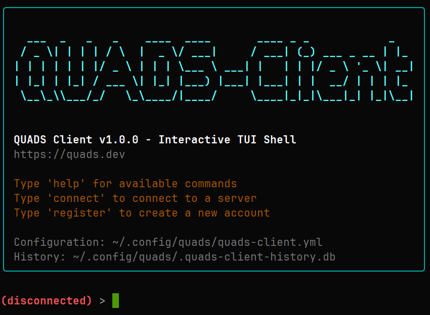
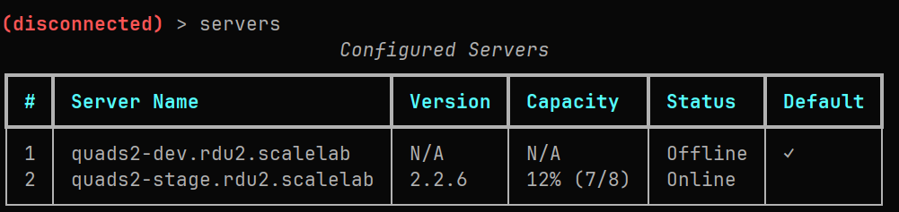

# quads-client

[](https://github.com/quadsproject/quads-client/actions/workflows/pytest.yml)
[](https://codecov.io/gh/quadsproject/quads-client)
[](https://pypi.org/project/quads-client/)
[](https://www.python.org/downloads/)
[](https://www.gnu.org/licenses/gpl-3.0)
[](https://github.com/psf/black)

QUADS Client is an interactive TUI (Text User Interface) shell for managing multiple QUADS server instances.

## Features

- **Multi-Server Support**: Connect to and manage multiple QUADS servers from a single interface
- **Bearer Token Authentication**: Secure JWT-based authentication via python-quads-lib
- **Interactive Shell**: Built on cmd2 with command history and comprehensive tab completion
- **Intelligent Tab Completion**: Context-aware autocompletion for all commands, arguments, cloud names, hostnames, assignment IDs, and server names
- **Rich UI**: Beautiful terminal output with colors, tables, and status indicators powered by python-rich
- **User Registration**: Non-admin users can register accounts and manage their own assignments
- **Command History**: SQLite-based persistent command history per server
- **Progress Tracking**: Real-time provisioning progress monitoring
- **Connection Management**: Easy switching between QUADS server instances
- **Thin Wrapper Design**: Server-side authorization via QUADS API

<p align="left">
  
</p>

<p align="left">
  
</p>

## Table of Contents

- [Installation](#installation)
  - [From PyPI (pip)](#from-pypi-pip)
  - [From RPM](#from-rpm)
  - [From Source](#from-source)
- [Configuration](#configuration)
- [How to Self-Schedule](#how-to-self-schedule)
- [Usage](#usage)
  - [Interactive Mode](#interactive-mode)
  - [One-Shot Commands](#one-shot-commands)
- [Commands](#commands)
  - [Connection Management](#connection-management)
  - [Server Management](#server-management)
  - [Cloud Management](#cloud-management)
  - [Self-Scheduling Mode (SSM)](#self-scheduling-mode-ssm)
  - [Host Management (Admin)](#host-management-admin)
  - [Schedule Management (Admin)](#schedule-management-admin)
  - [Available Hosts](#available-hosts)
  - [Other Commands](#other-commands)
- [Authorization](#authorization)
  - [Server Roles](#server-roles)
  - [User Registration & Assignments](#user-registration--assignments)
- [Architecture](#architecture)
- [Dependencies](#dependencies)
- [Development](#development)
  - [Building from Source](#building-from-source)
  - [Building RPM](#building-rpm)
  - [Code Formatting](#code-formatting)
- [Testing](#testing)
  - [Run Tests](#run-tests)
  - [Run Tests with Coverage](#run-tests-with-coverage)
  - [Manual Testing](#manual-testing)
- [Contributing](#contributing)
- [Links](#links)

## Installation

### From PyPI (pip)

* For Linux and Mac (with Python setup)
* Install the latest stable release from PyPI:

```bash
python3 -m venv venv
source venv/bin/activate
pip install quads-client
```

* Run QUADS Client
```bash
quads-client
```

* To upgrade to the latest version:

```bash
source venv/bin/activate
pip install --upgrade quads-client
```

* To deactivate the virtual environment when done:

```bash
deactivate
```

### From RPM

For Red Hat-based distributions (RHEL, Rocky, Fedora):

```bash
dnf copr enable quadsdev/python3-quads -y
dnf install quads-client
```

### From Source

For development or the latest unreleased features:

```bash
git clone https://github.com/quadsproject/quads-client.git
cd quads-client
python3 -m venv venv
source venv/bin/activate
pip install -e .
```

## Configuration

### Quick Setup (Recommended)

Use the interactive `add-quads-server` command:

```bash
quads-client
add-quads-server
# Follow the prompts to add your QUADS server
config-reload
connect <server_name>
register your.email@example.com YourPassword123
```

### Manual Configuration (Advanced)

Alternatively, manually create `~/.config/quads/quads-client.yml`:

```yaml
servers:
  quads1.rdu2.scalelab:
    url: https://quads1.rdu2.scalelab.example.com
    username: ""
    password: ""
    verify: true

  quads2.rdu2.scalelab:
    url: https://quads2.rdu2.scalelab.example.com
    username: ""
    password: ""
    verify: true

default_server: quads1.rdu2.scalelab
```

**Configuration Notes**:
- For new users: Leave `username` and `password` blank. Use the `register` command after connecting.
- For existing users: Fill in credentials to login automatically on connect.
- Specify the base URL only (no `/api/v3/` path, no port `:5000`). The client automatically appends the API path.
- `verify: true` enables SSL certificate verification (recommended). Set to `false` only for development/testing with self-signed certificates.

## Usage

### Interactive Mode

Launch the interactive shell:

```bash
quads-client
```

### One-Shot Commands

Execute a single command and exit:

```bash
quads-client connect quads1.rdu2.scalelab
quads-client cloud-list
```

## How to Self-Schedule

Quick start for regular users:

```bash
# 1. Connect and register
quads-client
connect quads1.rdu2.scalelab
register your.email@example.com YourPassword123

# 2. Schedule hosts (automatic for 5 days or until Sunday 21:00 UTC)
schedule 3 description "My dev environment"
schedule host01,host02 description "CI testing"
schedule host-list hosts.txt description "Perf lab"

# 3. Check your hosts
my-hosts
my-assignments

# 4. Release when done
terminate 42                    # Terminate entire assignment
terminate 42 host01.example.com # Release single host
```

That's it. No tickets, no admin approval required.

## Commands

### Tab Completion

QUADS Client provides comprehensive tab completion for all commands and their arguments:

**Command Completion**: Press `Tab` after typing partial command names
```
(quads1-dev) > clo<Tab>
cloud-create  cloud-delete  cloud-list
```

**Context-Aware Argument Completion**: Press `Tab` to complete command arguments based on live server data

- **Cloud names**: `cloud-delete <Tab>` → shows available clouds
- **Hostnames**: `mark-broken <Tab>` → shows non-broken hosts
- **Assignment IDs**: `terminate <Tab>` → shows your active assignment IDs
- **Server names**: `connect <Tab>` → shows configured servers
- **Keywords**: `schedule <Tab>` → shows options like `description`, `nowipe`, `vlan`, `qinq`, `model`, `ram`

**Examples**:
```
# SSM mode - schedule command shows hostnames first, then keywords
(quads1-dev) > schedule <Tab>
host01.example.com  host02.example.com  host03.example.com  1  2  3  5  10

(quads1-dev) > schedule 3 <Tab>
description  nowipe  vlan  qinq  model  ram  host-list

# Admin mode - schedule command shows cloud names first
(quads1-dev) > schedule <Tab>
cloud01  cloud02  cloud03

# Cloud operations
(quads1-dev) > cloud-list --cloud <Tab>
cloud01  cloud02  cloud03

# Terminate command
(quads1-dev) > terminate <Tab>
42  43  44

# Host management
(quads1-dev) > mark-broken <Tab>
host01.example.com  host02.example.com  host03.example.com
```

Tab completion dynamically fetches data from the connected QUADS server, ensuring you always see up-to-date options.

### Connection Management

```
connect [server|number] - Connect to a QUADS server by name or number from servers list
disconnect              - Disconnect from current server
status                  - Show connection status and user roles
```

**Examples**:
```bash
connect quads1.example.com  # Connect by server name
connect 2                   # Connect by server number from 'servers' list
```

### Server Management

```
servers              - List all configured servers with status
add-quads-server     - Interactive wizard to add a new QUADS server
add-server <name> <url> <username> <password> [--no-verify]  
                     - Add new server to configuration (advanced)
edit-server <name> [--url URL] [--username USER] [--password PASS] [--verify true|false]
                     - Edit existing server configuration
rm-server <name>     - Remove server from configuration
config-reload        - Reload configuration from file
```

**Adding a server (interactive method)**:
```bash
add-quads-server
# Follow the prompts:
#   1. Enter server name (e.g., quads1.example.com)
#   2. Enter server URL (e.g., https://quads1.example.com)
#   3. Enable SSL verification? [Y/n]
# Then: config-reload, connect, and register
```

### Cloud Management

```
cloud-list                         - List all clouds
cloud-list --cloud <name> --detail - Show detailed cloud information with hosts
cloud-create <name>                - Create a new cloud (admin only)
cloud-delete <name>                - Delete a cloud (admin only)
mod-cloud <name> [OPTIONS]         - Modify cloud attributes (admin only)
  --owner OWNER                    - Set cloud owner
  --description DESC               - Set cloud description
  --ticket TICKET                  - Set ticket number
  --wipe true|false                - Enable/disable wipe
  --ccusers CCUSERS                - Set CC users list
```

### Self-Scheduling Mode (SSM)

Self-Scheduling Mode allows regular (non-admin) users to schedule hosts without admin intervention. The QUADS server automatically creates assignments and clouds - **no tickets required**.

```
register <email> <password>                      - Register a new user
login                                            - Explicit login
whoami                                           - Show current user information
schedule <count|hostname[,hostname...]|host-list path> description <desc> [OPTIONS]
                                                 - Schedule hosts (SSM mode)
  nowipe                                         - Disable wipe (default: wipe enabled)
  vlan <id>                                      - VLAN ID
  qinq <0|1>                                     - QinQ mode
  model <model>                                  - Filter by model (count mode only)
  ram <GB>                                       - Minimum RAM in GB (count mode only)
my-assignments                                   - List all your assignments
my-hosts                                         - Show your currently scheduled hosts
available                                        - Show available hosts for self-scheduling
terminate <assignment-id> [hostname]             - Terminate assignment or release host
```

**SSM Syntax:**

```bash
# MODE 1: Count - just specify a NUMBER (QUADS picks hosts for you)
schedule 3 description "Dev testing"
schedule 5 description "Perf lab" model r640 ram 128  # With filters

# MODE 2: Specific hosts - comma-separated hostnames (NO SPACES!)
schedule host01.example.com,host02.example.com description "CI pipeline"

# MODE 3: Host list file - one hostname per line
schedule host-list ~/hosts.txt description "Batch test" vlan 1150 nowipe

# View and manage assignments
my-assignments
my-hosts
terminate 42
terminate 42 host03.example.com
```

**Common Mistakes:**
```bash
# ❌ WRONG - "hosts" is not a keyword!
schedule hosts 3 description "test"

# ✅ CORRECT - just the number
schedule 3 description "test"
```

**SSM Server Requirements:**
- QUADS server must have `self_serve_enabled: true` in quads.yml
- No ticketing system required for SSM mode
- Server limits: max 10 hosts per assignment, max 3 active assignments per user
- Auto-expiration: 5 days or Sunday 21:00 UTC (configurable server-side)

### Host Management (Admin)

```
ls-hosts            - List all hosts
mark-broken <host>  - Mark a host as broken
mark-repaired <host>- Mark a broken host as repaired
retire <host>       - Mark a host as retired
unretire <host>     - Mark a retired host as active
ls-broken           - List all broken hosts
ls-retired          - List all retired hosts
```

### Schedule Management (Admin)

```
schedule <cloud> <hosts|host-list path> <start> <end>  - Schedule hosts (admin mode)
ls-schedule [--host hostname] [--cloud cloudname]      - List schedules
mod-schedule --id <schedule_id> [--start <YYYY-MM-DD>] [--end <YYYY-MM-DD>]
rm-schedule <schedule_id>                               - Remove a schedule
extend <cloud|hostname> weeks <N>                       - Extend cloud/host by weeks
extend <cloud|hostname> date <YYYY-MM-DD HH:MM>         - Extend cloud/host to date
shrink --host <hostname> --weeks <number>               - Shrink a schedule
```

**Admin Examples:**

```bash
schedule cloud02 host01,host02,host03 2026-05-11 2026-06-11
schedule cloud17 host-list ~/hosts.txt now 2026-07-01
extend cloud02 weeks 2
extend cloud02 date "2026-05-17 22:00"
extend host01.example.com weeks 1
```

### Available Hosts

```
ls-available [OPTIONS]
  start YYYY-MM-DD        - Start date for availability
  end YYYY-MM-DD          - End date for availability
  model MODEL             - Filter by server model
  ram GB                  - Minimum RAM in GB
  gpu-vendor VENDOR       - GPU vendor (e.g., "NVIDIA Corporation")
  gpu-product PRODUCT     - GPU model (e.g., "Tesla V100")
  disk-size GB            - Minimum disk size in GB
  disk-type TYPE          - Disk type (nvme, ssd, sata)
  disk-count N            - Minimum number of disks
  interfaces N            - Minimum number of network interfaces
```

**Examples:**
```bash
ls-available model r640 ram 256
ls-available gpu-vendor "NVIDIA Corporation" gpu-product "Tesla V100"
ls-available disk-type nvme disk-count 2 interfaces 4
ls-available start 2026-06-01 end 2026-06-15 model r650
```

### Other Commands

```
version             - Show quads-client version
help [command]      - Show help for command(s)
exit / quit         - Exit the shell
```

## Authorization

quads-client is a thin wrapper around the QUADS API via python-quads-lib. All authorization is handled server-side by the QUADS server.

### Server Roles

The QUADS server implements two roles:

- **admin**: Full access to create/delete clouds, manage all schedules, and perform administrative operations
- **user**: Can view resources, create schedules, manage assignments, and schedule hosts

When a command requires elevated permissions, the server will return a 403 Forbidden error, which quads-client displays to the user.

### User Registration & Assignments

Users can register accounts directly from the CLI:

1. **Connect** to a server (credentials can be blank in config)
2. **Register** with `register <email> <password>`
3. Credentials are automatically saved to your config file
4. **Login** with the `login` command or reconnect

SSM users can:
- **Schedule** hosts with unified `schedule` command (count/hosts/host-list syntax)
- **View** their own resources with `my-assignments` and `my-hosts` (ownership enforced)
- **Terminate** assignments when done with `terminate` (own assignments only)
- **Duration**: Server-controlled (5 days or Sunday 21:00 UTC, whichever first)
- **Limits**: Max 10 hosts per assignment, max 3 active assignments per user

Command visibility:
- SSM users see only allowed commands (no `extend`, no admin commands)
- Admin users see all commands

The server controls which hosts can be self-scheduled via the `can_self_schedule` flag.

See [docs/INTEGRATION_ANALYSIS.md](docs/INTEGRATION_ANALYSIS.md) for complete API integration details.

## Architecture

```
quads-client/
├── src/quads_client/
│   ├── shell.py              - Main cmd2 shell
│   ├── config.py             - YAML configuration loader
│   ├── connection.py         - Multi-server connection manager
│   ├── error_handler.py      - Error handling and auth retry
│   ├── arg_parser.py         - Command argument parsing
│   ├── history.py            - SQLite command history
│   ├── progress.py           - Provisioning progress tracker
│   ├── rich_console.py       - Rich terminal UI
│   └── commands/             - Command modules
│       ├── available.py      - Available hosts
│       ├── cloud.py          - Cloud management
│       ├── connection.py     - Connection commands
│       ├── host.py           - Host management (admin)
│       ├── schedule.py       - Schedule management (admin)
│       ├── server.py         - Server configuration
│       ├── user.py           - User registration & self-scheduling
│       └── version.py        - Version command
├── conf/
│   └── quads-client.yml.example - Example configuration
├── tests/                    - pytest test suite
```

## Dependencies

- Python >= 3.13
- cmd2 >= 2.0.0
- quads-lib >= 0.1.9
- PyYAML >= 6.0.0
- argcomplete >= 3.1.2
- tabulate >= 0.9.0
- rich >= 13.0.0 (for enhanced terminal UI)

## Development

### Building from Source

```bash
python3 setup.py sdist
```

### Building RPM

```bash
rpmbuild -bb rpm/quads-client.spec \
  --define "_sourcedir $(pwd)/dist" \
  --define "_builddir $(pwd)/build" \
  --define "_rpmdir $(pwd)/rpms"
```

### Code Formatting

```bash
black --line-length 119 src/quads_client/
```

## Testing

### Run Tests

```bash
pytest tests/ -v
```

### Run Tests with Coverage

```bash
pytest tests/ --cov=quads_client --cov-report=html --cov-report=term
```

### Manual Testing

```bash
PYTHONPATH=src python3 -c "from quads_client.shell import QuadsClientShell; shell = QuadsClientShell(); shell.cmdloop()"
```

## Contributing

See [CONTRIBUTING.md](CONTRIBUTING.md) for guidelines on how to contribute to this project.

## Links

- QUADS Server: https://github.com/quadsproject/quads
- About QUADS: https://quads.dev
- Issues: https://github.com/quadsproject/quads-client/issues
