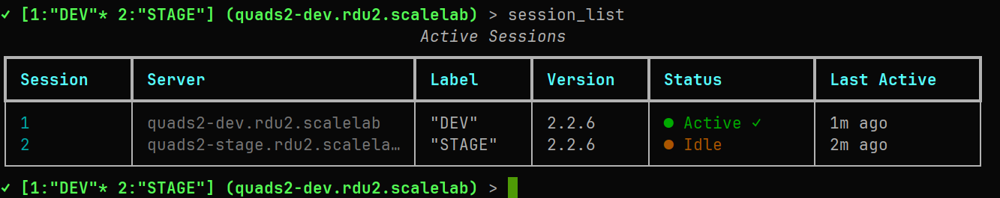
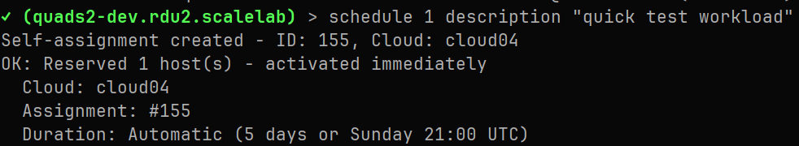
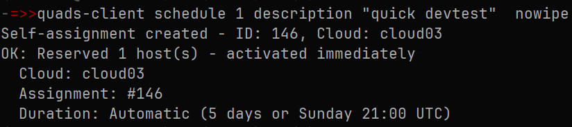
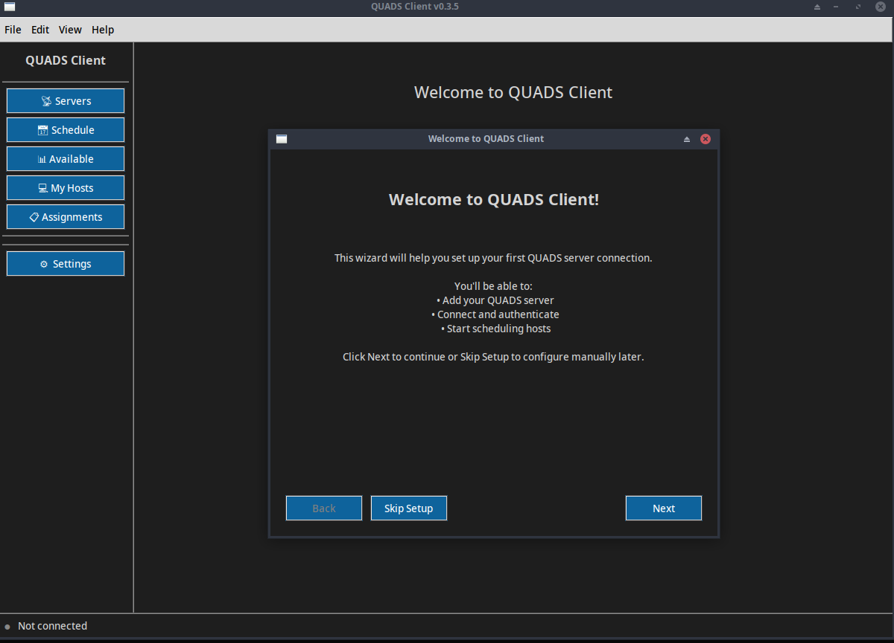
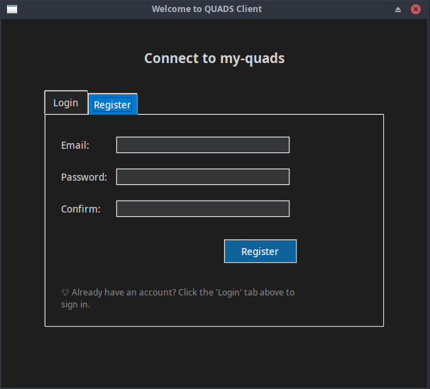
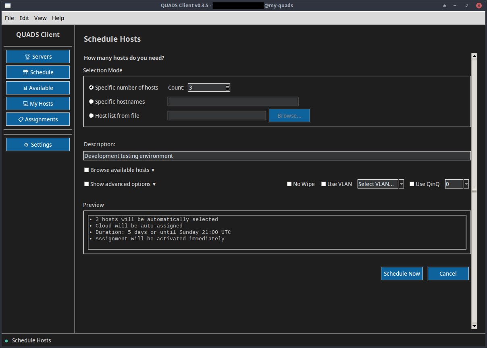
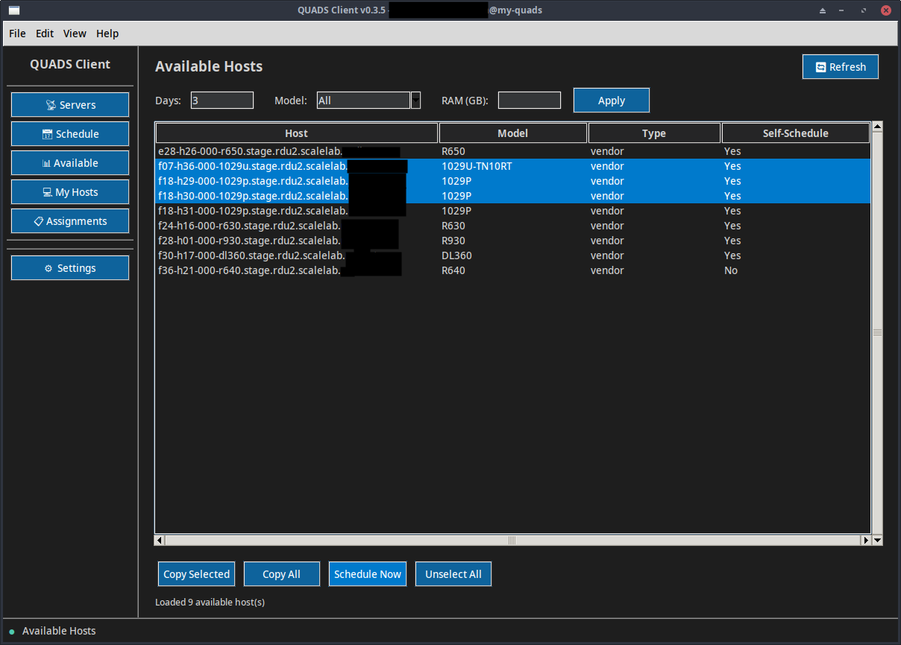
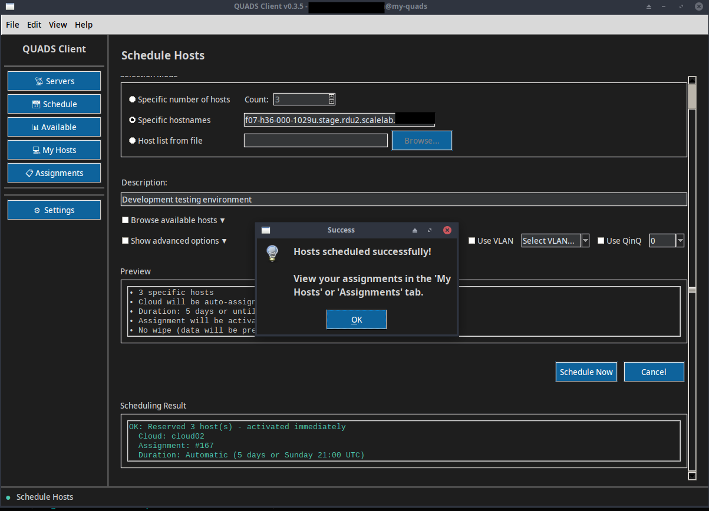
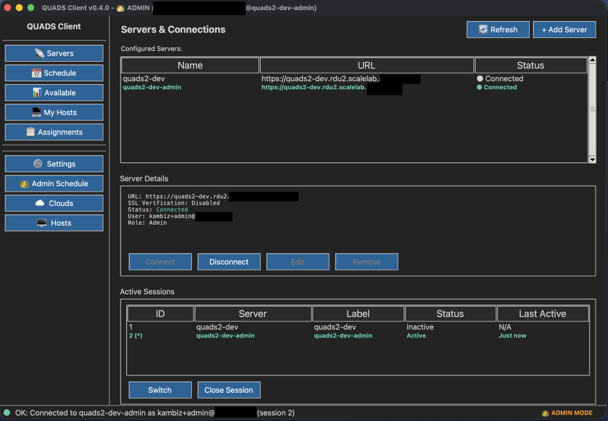
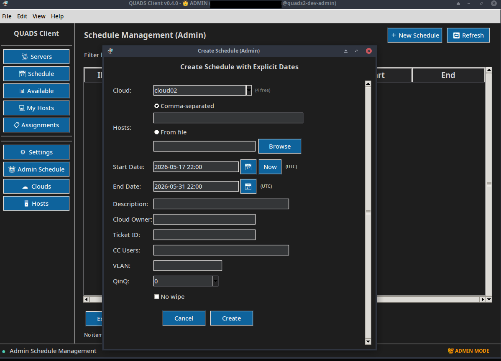

# quads-client

[](https://github.com/quadsproject/quads-client/actions/workflows/pytest.yml)
[](https://codecov.io/gh/quadsproject/quads-client)
[](https://pypi.org/project/quads-client/)
[](https://www.python.org/downloads/)
[](https://www.gnu.org/licenses/gpl-3.0)
[](https://github.com/psf/black)

QUADS Client provides both a powerful CLI and an intuitive GUI for managing multiple QUADS servers.

## Features

- **Dual Interface Options**:
  - **Standalone CLI**: Interactive shell with tab completion, scripting support, and one-shot commands
  - **Full-Featured Multi-Platform GUI**: Modern graphical interface for Linux/macOS with onboarding wizard, dark/light themes, and visual host management
- **Multi-Server Support**: Connect to and manage multiple QUADS servers from a single interface
- **Session Management**: Maintain multiple authenticated connections simultaneously and switch between them instantly
- **Bearer Token Authentication**: Secure JWT-based authentication via python-quads-lib
- **Interactive Shell**: Built on cmd2 with command history and comprehensive tab completion
- **Intelligent Tab Completion**: Context-aware autocompletion for all commands, arguments, cloud names, hostnames, assignment IDs, and server names
- **Rich UI**: Beautiful terminal output with colors, tables, and status indicators powered by python-rich
- **User Registration**: Non-admin users can register accounts and manage their own assignments
- **Command History**: SQLite-based persistent command history per server
- **Unified Schedule Command**: Combines cloud assignment creation and host scheduling in a single operation for simpler workflows
- **Progress Tracking**: Real-time provisioning progress monitoring
- **Connection Management**: Easy switching between QUADS server instances
- **Thin Wrapper Design**: Server-side authorization via QUADS API

## Table of Contents

- [Installation](#installation)
  - [From PyPI (pip)](#from-pypi-pip)
  - [Mac Native Application (pip)](#mac-native-application-pip)
  - [From RPM](#from-rpm)
  - [From Source](#from-source)
- [Configuration](#configuration)
- [How to Self-Schedule](#how-to-self-schedule)
- [Usage](#usage)
  - [GUI Mode](#gui-mode)
  - [Interactive Mode](#interactive-mode)
  - [One-Shot Commands](#one-shot-commands)
- [Commands](#commands)
  - [Connection Management](#connection-management)
  - [Multi-Server Session Management](#multi-server-session-management)
  - [Managing Multiple Users on Same Server](#managing-multiple-users-on-same-server)
  - [Server Management](#server-management)
  - [Cloud Management](#cloud-management)
  - [Self-Scheduling Mode (SSM)](#self-scheduling-mode-ssm)
  - [Host Management (Admin)](#host-management-admin)
  - [Schedule Management (Admin)](#schedule-management-admin)
  - [Available Hosts](#available-hosts)
  - [Other Commands](#other-commands)
- [Authorization](#authorization)
  - [Server Roles](#server-roles)
  - [User Registration & Assignments](#user-registration--assignments)
- [Architecture](#architecture)
- [Dependencies](#dependencies)
- [Development](#development)
  - [Building from Source](#building-from-source)
  - [Building RPM](#building-rpm)
  - [Code Formatting](#code-formatting)
- [Testing](#testing)
  - [Run Tests](#run-tests)
  - [Run Tests with Coverage](#run-tests-with-coverage)
  - [Manual Testing](#manual-testing)
- [Contributing](#contributing)
- [Screenshots](#screenshots)
  - [TUI CLI](#tui-cli)
  - [GUI](#gui)
- [Links](#links)

## Installation

### From PyPI (pip)

* For Linux and Mac (with Python setup)
* Install the latest stable release from PyPI:

```bash
python3 -m venv venv
source venv/bin/activate
pip install quads-client
```

* Run QUADS Client
```bash
quads-client
```

* Run QUADS Client GUI
```bash
quads-client-gui
```

* To upgrade to the latest version:


```bash
source venv/bin/activate
pip install --upgrade quads-client
```

* To deactivate the virtual environment when done:

```bash
deactivate
```

### Mac Native Application (pip)

For macOS users who want a double-clickable .app bundle:

```bash
# Install quads-client and pyinstaller
python3 -m venv venv
source venv/bin/activate
pip install quads-client pyinstaller

# Find site-packages path
SITE_PACKAGES=$(python3 -c "import site; print(site.getsitepackages()[0])")

# Create standalone app
pyinstaller --windowed --noconsole \
  --icon "$SITE_PACKAGES/quads_client/gui/assets/quads-client-gui.icns" \
  --name "QUADS Client GUI" \
  venv/bin/quads-client-gui

# Move to Applications
mv "dist/QUADS Client GUI.app" /Applications/
```

The app can now be launched from Applications or Spotlight.

### From RPM

For Fedora:

```bash
dnf copr enable quadsdev/python3-quads -y
dnf install quads-client
```

### From Source

For development or the latest unreleased features:

```bash
git clone https://github.com/quadsproject/quads-client.git
cd quads-client
python3 -m venv venv
source venv/bin/activate
pip install -e .
```

## Configuration

### Configuration File Location

| Operating System | Config File Location | Notes |
|-----------------|---------------------|-------|
| Linux | `~/.config/quads/quads-client.yml` | Follows XDG Base Directory spec; directory auto-created on first run |
| macOS | `~/.config/quads/quads-client.yml` | Standard CLI tool convention; directory auto-created on first run |
| Windows | `~/.config/quads/quads-client.yml` | Expands to `%USERPROFILE%\.config\quads\quads-client.yml` |
| FreeBSD | `~/.config/quads/quads-client.yml` | Follows XDG Base Directory spec; directory auto-created on first run |

### Quick Setup (Recommended)

> [!TIP]
> The `add-quads-server` command creates the configuration file interactively. This is the easiest way to get started.

Use the interactive `add-quads-server` command:

```bash
quads-client
add-quads-server
# Follow the prompts to add your QUADS server
config-reload
connect <server_name>
register your.email@example.com YourPassword123
```

### Manual Configuration (Advanced)

Alternatively, manually create the configuration file using the provided [example configuration](conf/quads-client.yml.example) as a template.

**Configuration Notes**:
- For new users: Leave `username` and `password` blank. Use the `register` command after connecting.
- For existing users: Fill in credentials to login automatically on connect.
- Specify the base URL only (no `/api/v3/` path, no port `:5000`). The client automatically appends the API path.
- `verify: true` enables SSL certificate verification (recommended). Set to `false` only for development/testing with self-signed certificates.

### SSL/TLS Security Indicator

The client displays a visual security indicator in the prompt showing the SSL/TLS status of your connection:

| Indicator | Color | Meaning |
|-----------|-------|---------|
| ✓ | Green | HTTPS with SSL certificate verification (trusted CA) |
| ! | Green | HTTPS without SSL certificate verification (self-signed or verification disabled) |
| ✗ | Yellow | HTTP (no encryption) |

**Example prompts:**
```
✓ (quads-prod.example.com) >   ← Secure HTTPS with verified certificate
! (quads-dev.example.com) >    ← HTTPS with self-signed certificate
✗ (quads-test.local) >         ← Insecure HTTP connection
```

> [!WARNING]
> Using `verify: false` or HTTP connections exposes your credentials and data to potential interception. For production use, always configure your QUADS server with valid SSL/TLS certificates.
> 
> **Setting up SSL/TLS on your QUADS server:**  
> See the [QUADS SSL configuration guide](https://github.com/quadsproject/quads#using-ssl-with-flask-api-and-quads) for instructions on configuring nginx with SSL certificates.

## Usage

### GUI Mode

For a graphical interface:

```bash
quads-client-gui
```

**GUI Features:**
- Onboarding wizard for first-time setup
- Server/connection management with session switching
- Self-scheduling interface for normal users
- My Hosts view with status monitoring
- Dark/light theme toggle
- Cross-platform (Linux, macOS, Windows)

**Installation:**

**Option 1: Fedora (Recommended for Linux)**
```bash
# Includes desktop file, icon, and all dependencies
dnf install quads-client-gui
```

**Option 2: pip (Linux/macOS)**
```bash
# Linux: Install tkinter first (system package)
# Fedora:
sudo dnf install python3-tkinter

# macOS: tkinter included with Python from python.org
# No extra steps needed

# Then install quads-client via pip
python3 -m venv venv
source venv/bin/activate
pip install quads-client
quads-client-gui
```

**Notes:**
- **Linux**: `tkinter` is a system package, not available via pip. Must be installed at the system level before creating your venv.
- **macOS**: `tkinter` is included with Python from python.org. No extra steps needed.
- **RPM**: When installed via RPM, QUADS Client GUI appears in your Applications menu under System or Network categories.

### Interactive Mode

Launch the interactive shell:

```bash
quads-client
```

### One-Shot Commands

Execute a single command and exit without entering interactive mode. The client automatically connects to your default server (configured in `quads-client.yml`) and returns proper exit codes for scripting.

**Basic Commands (no connection required):**
```bash
quads-client version                # Show client version
quads-client help                   # Show available commands
quads-client servers                # List configured servers
```

**Auto-Connect Commands:**

One-shot commands requiring a connection will automatically connect to your default server (set `default_server` in `~/.config/quads/quads-client.yml`).

```bash
# View resources (uses default server)
quads-client cloud_list             # List all clouds
quads-client my_hosts               # Show your scheduled hosts
quads-client my_assignments         # List your assignments

# Check available hosts
quads-client ls_available model r650 ram 256
quads-client ls_available start 2026-06-01 end 2026-06-15
```

**Specify Non-Default Server:**

To run a one-shot command against a non-default server, use `connect <server> <command>`:

```bash
# Connect to specific server and run command
quads-client connect quads-prod my_assignments
quads-client connect quads-stage cloud_list
quads-client connect quads-dev.dc1.example.com available

# Works with fuzzy server matching (FQDN, short names)
quads-client connect quads-stage.dc2.example.com ls_available
```

**Self-Schedule (SSM Mode):**

Quick one-shot scheduling for regular users:

```bash
# Schedule hosts by count (QUADS picks hosts automatically)
quads-client schedule 3 description "dev testing"
quads-client schedule 5 description "perf lab" model r640 ram 128

# Schedule specific hosts
quads-client schedule host01.example.com,host02.example.com description "CI pipeline"

# Schedule from host list file
quads-client schedule host-list ~/hosts.txt description "batch test"

# Terminate assignment when done
quads-client terminate 42
```

**Admin Operations:**

```bash
# Unified schedule command (creates assignment + schedules in one step)
quads-client schedule cloud02 host01,host02 2026-05-15 2026-06-15 \
  description "Test Environment" \
  cloud-owner jdoe \
  cloud-ticket JIRA-456

# Schedule with host list file
quads-client schedule cloud17 host-list ~/hosts.txt now 2026-07-01 \
  description "Performance Lab" \
  cloud-owner alice \
  cloud-ticket JIRA-789

# Extend schedules
quads-client extend cloud05 weeks 2
quads-client extend cloud17 date "2026-06-15 22:00"
quads-client extend host01.example.com weeks 1

# Shrink schedules
quads-client shrink host01.example.com weeks 2

# Cloud utilities
quads-client find-free-cloud
quads-client cloud-only cloud05
quads-client ls-vlan
```

**Exit Codes:**

One-shot commands return standard exit codes for scripting:

- `0` - Success
- `1` - Command error (validation, API error)
- `3` - Connection error (no default server, connection failed)
- `130` - Interrupted (Ctrl+C)

**Scripting Example:**

```bash
#!/bin/bash
# Check if hosts are available before scheduling
if quads-client ls_available model r650 ram 256 > /dev/null 2>&1; then
    quads-client schedule 3 description "CI job ${BUILD_ID}" model r650 ram 256
    echo "Scheduled hosts successfully"
else
    echo "No hosts available matching criteria"
    exit 1
fi
```

**Tips:**
- Set `default_server` in your config to enable auto-connect
- One-shot commands suppress banner and connection messages for clean output
- Use `> /dev/null 2>&1` to suppress all output in scripts
- Commands use underscores (e.g., `cloud_list`, `my_hosts`)
- All table output goes to stdout for easy parsing

## How to Self-Schedule

Quick start for regular users:

```bash
# 1. Connect and register
quads-client
connect quads-prod.example.com
register your.email@example.com YourPassword123

# 2. Schedule hosts (automatic for 5 days or until Sunday 21:00 UTC)
schedule 3 description "My dev environment"
schedule host01,host02 description "CI testing"
schedule host-list hosts.txt description "Perf lab"

# 3. Check your hosts
my-hosts
my-assignments

# 4. Release when done
terminate 42                    # Terminate entire assignment
terminate 42 host01.example.com # Release single host
```

That's it. No tickets, no admin approval required.

## Commands

### Tab Completion

QUADS Client provides comprehensive tab completion for all commands and their arguments:

**Command Completion**: Press `Tab` after typing partial command names
```
(quads1-dev) > clo<Tab>
cloud-list  cloud-only
```

**Context-Aware Argument Completion**: Press `Tab` to complete command arguments based on live server data

- **Cloud names**: `mod-cloud <Tab>` → shows available clouds
- **Hostnames**: `mark-broken <Tab>` → shows non-broken hosts
- **Assignment IDs**: `terminate <Tab>` → shows your active assignment IDs
- **Server names**: `connect <Tab>` → shows configured servers
- **Keywords**: `schedule <Tab>` → shows options like `description`, `nowipe`, `vlan`, `qinq`, `model`, `ram`

**Examples**:
```
# SSM mode - schedule command shows hostnames first, then keywords
(quads1-dev) > schedule <Tab>
host01.example.com  host02.example.com  host03.example.com  1  2  3  5  10

(quads1-dev) > schedule 3 <Tab>
description  nowipe  vlan  qinq  model  ram  host-list

# Admin mode - schedule command shows cloud names first
(quads1-dev) > schedule <Tab>
cloud01  cloud02  cloud03

# Cloud operations
(quads1-dev) > cloud-list cloud <Tab>
cloud01  cloud02  cloud03

# Terminate command
(quads1-dev) > terminate <Tab>
42  43  44

# Host management
(quads1-dev) > mark-broken <Tab>
host01.example.com  host02.example.com  host03.example.com
```

Tab completion dynamically fetches data from the connected QUADS server, ensuring you always see up-to-date options.

### Connection Management

```
connect quads1.example.com                   - Connect to a QUADS server by name
connect 2                                    - Connect by server number from 'servers' list
connect quads-prod session prod              - Create a labeled session
disconnect                                   - Disconnect from current server
status                                       - Show connection status and active sessions
```

**Examples**:
```bash
connect quads1.example.com  # Connect by server name
connect 2                   # Connect by server number from 'servers' list
connect quads-prod session prod  # Create a labeled session
```

**Fuzzy Server Name Matching:**

The `connect` command supports flexible server name matching for convenience:

```bash
# Config has: "quads-dev.dc1" with URL "https://quads-dev.dc1.example.com"

connect quads-dev.dc1                    # Exact match (config key)
connect quads-dev.dc1.example.com        # FQDN match (from URL)
connect https://quads-dev.dc1.example.com # Full URL match
```

The client will intelligently resolve:
1. **Exact match** - Matches config keys exactly
2. **URL matching** - Strips `https://` and trailing slashes to match server URLs
3. **Prefix matching** - If unique, matches shortened names (e.g., `quads-prod`)

This allows you to connect using the FQDN even if your config uses a shortened alias.

### Multi-Server Session Management

QUADS Client allows you to maintain multiple authenticated connections simultaneously. This is useful when working across multiple environments (dev, staging, production) or comparing data between servers.

**Key Benefits:**
- **No re-authentication**: Sessions stay authenticated when you switch between them
- **Instant switching**: Move between servers without reconnecting
- **Labeled sessions**: Use memorable names instead of full server hostnames
- **Session visibility**: See all active connections at a glance

**Session Commands:**
```
session-create quads-prod label prod      - Create new session with optional label
session prod                              - Quick switch to session by ID or label
session-switch                            - Toggle to previous session (like screen Ctrl+A Ctrl+A)
session-switch 2                          - Switch to specific session by ID
session-list                              - Show all active sessions with status
session-close 2                           - Close specific session
session-close-all                         - Close all inactive sessions
```

> [!TIP]
> **Quick Toggle**: Use `session-switch` (or just `session`) with no arguments to toggle between your last two sessions, similar to GNU screen's `Ctrl+A Ctrl+A` behavior. Perfect for bouncing between two environments!

**Quick Start Example:**
```bash
# Connect to multiple servers with labels
> connect quads-prod.example.com session prod
OK: Connected to quads-prod.example.com as user@example.com (session 1)

> connect quads-dev.example.com session dev
OK: Connected to quads-dev.example.com as user@example.com (session 2)

# Prompt shows active sessions: [1:prod 2:dev*]
✓ [1:prod 2:dev*] (quads-dev) >

# Quick switch between environments
> session prod
Switched to session 1 (prod)
✓ [1:prod* 2:dev] (quads-prod) > cloud-list
[shows production clouds]

> session dev
Switched to session 1 (dev)
✓ [1:prod 2:dev*] (quads-dev) >

# View all sessions
> session-list
┏━━━━━━━━━━┳━━━━━━━━━━━━━━━━━━━━━━━━━━┳━━━━━━━━━┳━━━━━━━━━┳━━━━━━━━━━━━━━┳━━━━━━━━━━━━━━┓
┃ Session  ┃ Server                   ┃ Label   ┃ Version ┃ Status       ┃ Last Active  ┃
┡━━━━━━━━━━╇━━━━━━━━━━━━━━━━━━━━━━━━━━╇━━━━━━━━━╇━━━━━━━━━╇━━━━━━━━━━━━━━╇━━━━━━━━━━━━━━┩
│ 1        │ quads-prod.example.com   │ prod    │ 2.2.6   │ ● Idle       │ 2m ago       │
│ 2        │ quads-dev.example.com    │ dev     │ 2.2.6   │ ● Active ✓   │ now          │
└──────────┴──────────────────────────┴─────────┴─────────┴──────────────┴──────────────┘
```

**Session Indicators in Prompt:**

When you have multiple sessions, the prompt displays them for quick reference:
```
✓ [1:prod 2:dev* 3:stage] (quads-dev) >
   │       │       └─ Asterisk marks active session
   │       └───────── Session IDs with labels
   └─────────────────── SSL status indicator
```

**Common Workflows:**

Compare environments:
```bash
> connect quads-prod session prod
> connect quads-dev session dev
> session prod
> cloud-list cloud cloud05 detail  # Check prod state
> session-switch  # Toggle back to dev
> cloud-list cloud cloud05 detail  # Compare with dev
> session-switch  # Toggle back to prod
```

Work in dev, monitor prod:
```bash
> connect quads-dev session dev
> connect quads-prod session prod
> session dev
> schedule 3 description "Testing new feature"
> session-switch  # Quick toggle to production
> my-hosts      # Verify prod assignments
> session-switch  # Toggle back to development work
```

**Tips:**
- Sessions remain authenticated even when inactive
- Use `session-close-all` to clean up when switching projects
- The `status` command shows all sessions when you have multiple connections
- Configuration changes with `config-reload` update all active sessions

### Managing Multiple Users on Same Server

You can configure multiple user accounts for the same QUADS server by using different "friendly names" in your configuration. This is useful for:

- **Admin + Regular User**: Separate admin and self-schedule workflows
- **Multiple Team Members**: Share a workstation with separate QUADS accounts
- **Testing**: Different permission levels or testing scenarios

**How It Works:**

The same server URL can be added multiple times with different names and credentials:

```bash
# Add admin user account
> add-quads-server
Enter server name: admin-quads2-dev
Enter server URL: https://quads2-dev.rdu2.scalelab.example.com
Enable SSL verification? [Y/n]: Y

# Add regular user account  
> add-quads-server
Enter server name: quads2-dev
Enter server URL: https://quads2-dev.rdu2.scalelab.example.com  # Same URL!
Enable SSL verification? [Y/n]: Y

> config-reload
```

**Configuration Result:**

```yaml
servers:
  admin-quads2-dev:
    url: https://quads2-dev.rdu2.scalelab.example.com
    username: admin+wfoster@example.com
    password: ""
    verify: true
    
  quads2-dev:
    url: https://quads2-dev.rdu2.scalelab.example.com  # Same server!
    username: wfoster@example.com
    password: ""
    verify: true
```

**Usage Example:**

```bash
# Connect as admin for administrative tasks
> connect admin-quads2-dev session admin
OK: Connected to admin-quads2-dev as admin+wfoster@example.com (session 1)

# Connect as regular user for self-scheduling
> connect quads2-dev session user
OK: Connected to quads2-dev as wfoster@example.com (session 2)

# Prompt shows both sessions to same server
✓ [1:admin 2:user*] (quads2-dev) >

# Toggle between admin and user sessions
> session-switch
Switched to session 1 (admin)
✓ [1:admin* 2:user] (quads2-dev) [ADMIN] >

# Admin work
> extend cloud05 weeks 2

# Back to user session
> session-switch
Switched to session 2 (user)
✓ [1:admin 2:user*] (quads2-dev) >

# Self-schedule work (SSM)
> schedule 3 description "Testing new feature"
```

**Benefits:**

- **Role Separation**: Keep admin and user workflows clearly separated
- **Quick Switching**: Toggle between accounts with `session-switch`
- **Visual Indicators**: Prompt shows `[ADMIN]` badge for admin sessions
- **Command Visibility**: Admin commands only visible in admin sessions
- **Credential Security**: Each account's credentials stored separately

**Use Cases:**

1. **Admin + SSM User**: Test both admin and self-service workflows
2. **Multi-User Workstation**: Team members with separate accounts
3. **Permission Testing**: Compare admin vs user permissions
4. **Training**: Demonstrate different user experiences

> [!NOTE]
> This works because the server name is the configuration key, while the URL can be reused. Each entry maintains separate credentials and session state.

### Server Management

```
servers              - List all configured servers with status
add-quads-server     - Interactive wizard to add a new QUADS server
add-server quads3 https://quads3.example.com user@example.com password123 [noverify]  
                     - Add new server to configuration (advanced)
edit-server quads3 [url https://new.example.com] [username newuser@example.com] 
                   [password newpass] [verify true|false]
                     - Edit existing server configuration
rm-server quads3     - Remove server from configuration
config-reload        - Reload configuration from file
```

**Adding a server (interactive method)**:
```bash
add-quads-server
# Follow the prompts:
#   1. Enter server name (e.g., quads1.example.com)
#   2. Enter server URL (e.g., https://quads1.example.com)
#   3. Enable SSL verification? [Y/n]
# Then: config-reload, connect, and register
```

### Cloud Management

```
cloud-list                                         - List all clouds
cloud-list cloud cloud05 detail                    - Show detailed cloud info with hosts
mod-cloud <cloud_name> [OPTIONS]                   - Modify cloud attributes (admin only)
  cloud-owner <username>                           - Set cloud owner
  description <text>                               - Set cloud description
  cloud-ticket <ticket_id>                         - Set ticket ID
  cc-users <user1,user2>                           - Comma-separated CC users
  vlan <vlan_id>                                   - VLAN ID number
  qinq <0|1>                                       - QinQ setting
  wipe                                             - Enable host wiping
  nowipe                                           - Disable host wiping
find-free-cloud                                    - List clouds without active assignments
cloud-only <cloud_name>                            - List all hosts assigned to a specific cloud
ls-vlan                                            - List VLANs with assigned clouds
```

**Examples:**
```bash
# Modify cloud assignment properties
mod-cloud cloud05 description "Updated test environment"
mod-cloud cloud02 cloud-owner alice cloud-ticket JIRA-456
mod-cloud cloud17 cc-users bob@example.com,charlie@example.com wipe

# Find available clouds and check assignments
find-free-cloud
cloud-only cloud05
```

> [!NOTE]
> The `cloud-create` and `cloud-delete` commands have been removed for safety. Use the unified `schedule` command which automatically creates assignments and manages cloud lifecycle.

### Self-Scheduling Mode (SSM)

Self-Scheduling Mode allows regular (non-admin) users to schedule hosts without admin intervention. The QUADS server automatically creates assignments and clouds - **no tickets required**.

```
register <email> <password>                      - Register a new user
login                                            - Explicit login
whoami                                           - Show current user information
schedule <count|hostname[,hostname...]|host-list path> description <desc> [OPTIONS]
                                                 - Schedule hosts (SSM mode)
  nowipe                                         - Disable wipe (default: wipe enabled)
  vlan <id>                                      - VLAN ID
  qinq <0|1>                                     - QinQ mode
  model <model>                                  - Filter by model (count mode only)
  ram <GB>                                       - Minimum RAM in GB (count mode only)
my-assignments                                   - List all your assignments
my-hosts                                         - Show your currently scheduled hosts
available                                        - Show available hosts for self-scheduling
terminate <assignment-id> [hostname]             - Terminate assignment or release host
```

**SSM Syntax:**

```bash
# MODE 1: Count - just specify a NUMBER (QUADS picks hosts for you)
schedule 3 description "Dev testing"
schedule 5 description "Perf lab" model r640 ram 128  # With filters

# MODE 2: Specific hosts - comma-separated hostnames (NO SPACES!)
schedule host01.example.com,host02.example.com description "CI pipeline"

# MODE 3: Host list file - one hostname per line
schedule host-list ~/hosts.txt description "Batch test" vlan 1150 nowipe

# View and manage assignments
my-assignments
my-hosts
terminate 42
terminate 42 host03.example.com
```

**Common Mistakes:**
```bash
# ❌ WRONG - "hosts" is not a keyword!
schedule hosts 3 description "test"

# ✅ CORRECT - just the number
schedule 3 description "test"
```

**SSM Server Requirements:**
- QUADS server must have `self_serve_enabled: true` in quads.yml
- No ticketing system required for SSM mode
- Server limits: max 10 hosts per assignment, max 3 active assignments per user
- Auto-expiration: 5 days or Sunday 21:00 UTC (configurable server-side)

### Host Management (Admin)

```
ls-hosts                         - List all hosts
mark-broken host01.example.com   - Mark a host as broken
mark-repaired host01.example.com - Mark a broken host as repaired
retire host01.example.com        - Mark a host as retired
unretire host01.example.com      - Mark a retired host as active
ls-broken                        - List all broken hosts
ls-retired                       - List all retired hosts
```

### Schedule Management (Admin)

The unified `schedule` command combines cloud assignment creation and host scheduling into a single operation, providing feature parity with QUADS core CLI in a simpler workflow.

**Syntax:**
```
schedule <cloud> <hosts|host-list path> <start> <end> [OPTIONS]

Hosts:
  host01.example.com                 - Single hostname
  host01,host02,host03               - Comma-separated list
  host-list ~/hosts.txt              - File with hostnames (whitespace-separated)

Date/Time Formats:
  "2026-05-07 13:00"                 - Full date and time (YYYY-MM-DD HH:MM, requires quotes)
  now                                - Immediate start (start date only)

Options:
  description <text>                 - Assignment description (required for new assignments)
  cloud-owner <username>             - Cloud owner (required for new assignments)
  cloud-ticket <ticket_id>           - Ticket ID (required for new assignments)
  cc-users <user1,user2>             - Comma-separated CC users
  vlan <vlan_id>                     - VLAN ID number
  qinq <0|1>                         - QinQ setting (default 0)
  nowipe                             - Don't wipe hosts (default: wipe=true)

Other Schedule Commands:
  ls-schedule [host <hostname>] [cloud <cloud>]             - List schedules
  mod-schedule id <id> [start <date>] [end <date>]          - Modify schedule dates
  rm-schedule <schedule_id>                                 - Remove a schedule
  extend <cloud|hostname> weeks <N>                         - Extend by weeks
  extend <cloud|hostname> date "YYYY-MM-DD HH:MM"           - Extend to specific date
  shrink <hostname> weeks <N>                               - Shrink schedule by weeks
```

**Unified Schedule Examples:**

```bash
# Create new assignment and schedule hosts
schedule cloud02 host01,host02 "2026-05-15 22:00" "2026-06-15 22:00" \
  description "OpenStack Testing" \
  cloud-owner jdoe \
  cloud-ticket JIRA-456 \
  cc-users alice,bob \
  vlan 1234 \
  qinq 1 \
  nowipe

# Create assignment with specific date/time
schedule cloud03 host01,host02 "2026-05-07 13:00" "2026-05-08 22:00" \
  description "Test Environment" \
  cloud-owner jdoe \
  cloud-ticket JIRA-999

# Schedule hosts to existing assignment (simpler - no assignment options needed)
schedule cloud02 host03,host04 "2026-05-15 22:00" "2026-06-15 22:00"

# Use host list file with immediate start
schedule cloud17 host-list ~/hosts.txt now "2026-07-01 22:00" \
  description "Performance Lab" \
  cloud-owner alice \
  cloud-ticket JIRA-789

# Extend and shrink operations
extend cloud02 weeks 2
extend cloud02 date "2026-05-17 22:00"
extend host01.example.com weeks 1
shrink host01.example.com weeks 2
```

**How Unified Schedule Works:**

1. **Checks for active assignment** - If cloud has no assignment, creates one automatically
2. **Pre-checks host availability** - Validates hosts are available for the date range
3. **Creates schedules** - Links hosts to the assignment for specified dates
4. **Server validates** - All validation handled by QUADS server API

**Date/Time Handling:**
- Full format (`"2026-05-07 13:00"`) → Always include date and time with quotes
- Immediate start (`now`) → Starts right away (for start date only)

**Advantages over QUADS core CLI:**
- Single command instead of `--define-cloud` + `--add-schedule`
- Automatic assignment creation when needed
- Pre-flight availability checks
- Flexible date/time formats
- Clear error messages from server
- Simpler syntax, fewer steps

### Available Hosts

```
ls-available [OPTIONS]
  start YYYY-MM-DD        - Start date for availability
  end YYYY-MM-DD          - End date for availability
  model MODEL             - Filter by server model
  ram GB                  - Minimum RAM in GB
  gpu-vendor VENDOR       - GPU vendor (e.g., "NVIDIA Corporation")
  gpu-product PRODUCT     - GPU model (e.g., "Tesla V100")
  disk-size GB            - Minimum disk size in GB
  disk-type TYPE          - Disk type (nvme, ssd, sata)
  disk-count N            - Minimum number of disks
  interfaces N            - Minimum number of network interfaces
```

**Examples:**
```bash
ls-available model r640 ram 256
ls-available gpu-vendor "NVIDIA Corporation" gpu-product "Tesla V100"
ls-available disk-type nvme disk-count 2 interfaces 4
ls-available start 2026-06-01 end 2026-06-15 model r650
```

### Other Commands

```
version             - Show quads-client version
help [command]      - Show help for command(s)
exit / quit         - Exit the shell
```

## Authorization

quads-client is a thin wrapper around the QUADS API via python-quads-lib. All authorization is handled server-side by the QUADS server.

### Server Roles

The QUADS server implements two roles:

- **admin**: Full access to create/delete clouds, manage all schedules, and perform administrative operations
- **user**: Can view and filter available resources; limited to self-scheduling for creating assignments

When a command requires elevated permissions, the server will return a 403 Forbidden error, which quads-client displays to the user.

### User Registration & Assignments

Users can register accounts directly from the CLI:

1. **Connect** to a server (credentials can be blank in config)
2. **Register** with `register <email> <password>`
3. Credentials are automatically saved to your config file
4. **Login** with the `login` command or reconnect

SSM users can:
- **Schedule** hosts with unified `schedule` command (count/hosts/host-list syntax)
- **View** their own resources with `my-assignments` and `my-hosts` (ownership enforced)
- **Terminate** assignments when done with `terminate` (own assignments only)
- **Duration**: Server-controlled (5 days or Sunday 21:00 UTC, whichever first)
- **Limits**: Max 10 hosts per assignment, max 3 active assignments per user

Command visibility:
- SSM users see only allowed commands (no `extend`, no admin commands)
- Admin users see all commands

The server controls which hosts can be self-scheduled via the `can_self_schedule` flag.

See [docs/INTEGRATION_ANALYSIS.md](docs/INTEGRATION_ANALYSIS.md) for complete API integration details.

## Architecture

```
quads-client/
├── src/quads_client/
│   ├── shell.py              - Main cmd2 shell
│   ├── config.py             - YAML configuration loader
│   ├── connection.py         - Server connection manager
│   ├── session_manager.py    - Multi-session management
│   ├── error_handler.py      - Error handling and auth retry
│   ├── arg_parser.py         - Command argument parsing
│   ├── history.py            - SQLite command history
│   ├── progress.py           - Provisioning progress tracker
│   ├── rich_console.py       - Rich terminal UI
│   ├── utils.py              - Shared utility functions (DRY helpers)
│   ├── auth.py               - Authentication utilities
│   ├── cli/
│   │   ├── __init__.py
│   │   └── main.py           - CLI entry point
│   ├── gui/                  - GUI application (MVC pattern, excluded from coverage)
│   │   ├── __init__.py       - GUI entry point
│   │   ├── main.py           - Main application window
│   │   ├── theme.py          - Dark/light theme manager
│   │   ├── controllers/
│   │   │   └── gui_shell.py  - Adapter between GUI and command classes
│   │   ├── views/            - Feature-specific views
│   │   │   ├── onboarding.py - First-time setup wizard
│   │   │   ├── connection.py - Server connection/auth view
│   │   │   ├── schedule.py   - Self-scheduling view (SSM users)
│   │   │   ├── my_hosts.py   - My hosts view
│   │   │   ├── assignments.py- Assignments view
│   │   │   ├── settings.py   - Settings/preferences view
│   │   │   └── about.py      - About dialog
│   │   └── widgets/          - Reusable custom widgets
│   │       ├── base.py       - Base widget classes
│   │       ├── dialogs.py    - Dialog helpers
│   │       └── server_list.py- Server connection list widget
│   └── commands/             - Command modules (business logic)
│       ├── __init__.py
│       ├── available.py      - Available hosts
│       ├── cloud.py          - Cloud management
│       ├── connection.py     - Connection commands
│       ├── host.py           - Host management (admin)
│       ├── schedule.py       - Schedule management (admin)
│       ├── server.py         - Server configuration (programmatic methods)
│       ├── session.py        - Session management
│       ├── user.py           - User registration & self-scheduling (programmatic methods)
│       └── version.py        - Version command
├── conf/
│   └── quads-client.yml.example - Example configuration
├── tests/                    - pytest test suite (519 tests, 71.0% coverage)
│   ├── test_commands_programmatic.py - Tests for GUI-supporting programmatic methods
│   └── ...                   - Other test files
├── rpm/
│   └── quads-client.spec     - RPM package specification
├── images/                   - Screenshots and documentation images
├── setup.py                  - Package setup configuration
├── pyproject.toml            - Modern Python project metadata
├── requirements.txt          - Production dependencies
├── requirements-dev.txt      - Development dependencies
├── pytest.ini                - pytest configuration
└── .coveragerc               - Coverage config (GUI excluded per MVC best practices)
```

## Dependencies

- Python >= 3.13
- cmd2 >= 2.0.0
- quads-lib >= 0.1.9
- PyYAML >= 6.0.0
- argcomplete >= 3.1.2
- tabulate >= 0.9.0
- rich >= 13.0.0 (for enhanced terminal UI)

## Development

### Building from Source

```bash
python3 setup.py sdist
```

### Building RPM

```bash
rpmbuild -bb rpm/quads-client.spec \
  --define "_sourcedir $(pwd)/dist" \
  --define "_builddir $(pwd)/build" \
  --define "_rpmdir $(pwd)/rpms"
```

### Code Formatting

```bash
black --line-length 119 src/quads_client/
```

## Testing

### Run Tests

```bash
pytest tests/ -v
```

### Run Tests with Coverage

```bash
pytest tests/ --cov=quads_client --cov-report=html --cov-report=term
```

### Manual Testing

**CLI (Interactive Shell):**
```bash
PYTHONPATH=src python3 -c "from quads_client.shell import QuadsClientShell; shell = QuadsClientShell(); shell.cmdloop()"
```

**GUI:**
```bash
PYTHONPATH=./src python3 -m quads_client.gui
```

## Contributing

See [CONTRIBUTING.md](CONTRIBUTING.md) for guidelines on how to contribute to this project.

## Screenshots

### TUI CLI

**quads TUI client**

<p align="left">
  
</p>

**TUI CLI servers list**

<p align="left">
  
</p>

**TUI CLI active sessions list**

<p align="left">
  
</p>

**TUI CLI self-scheduling**

<p align="left">
  
</p>

**TUI CLI one-shot self-scheduling**

<p align="left">
  
</p>

### GUI

**Setup Wizard**

<p align="left">
  
</p>

**Login or Register**

<p align="left">
  
</p>

**GUI one-shot self-scheduling**

<p align="left">
  
</p>

**Self-scheduling filtering by capability and model**

<p align="left">
  
</p>

**Self-scheduling in action**

<p align="left">
  
</p>

**GUI Admin View**

<p align="left">
  
</p>

**GUI Admin Adding Future Schedules**

<p align="left">
  
</p>

## Links

- QUADS Server: https://github.com/quadsproject/quads
- About QUADS: https://quads.dev
- Issues: https://github.com/quadsproject/quads-client/issues
